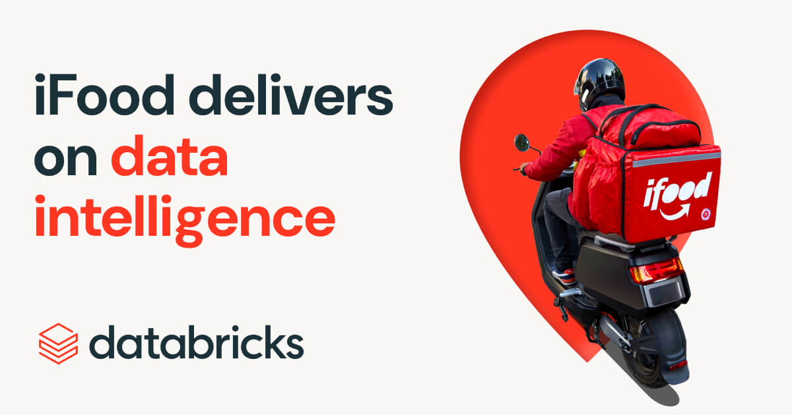
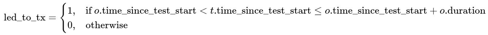
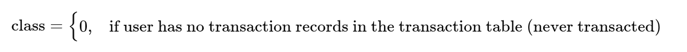
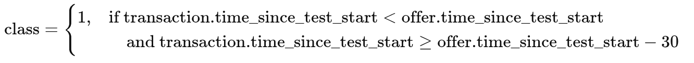
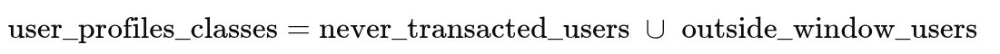

## Marketing and Offer Impact Analysis and Prediction

# General Instructions

In this project, we analyze how offers impact buying behavior and how we can improve the marketing efforts so that it is delivered to the right users.

**Project details:**
The code was developed on Databricks. Therefore, it can be shared on databricks if required. There are some comments that can be uncommented so that you can run the code on databricks default schema. The _modeling-marketing-offers_ can be run by directly acessing the data folder. However, the _data-processing-marketing-offers_ must run directly on Databricks as we are doing the entire preprocessing using pyspark dataframe. It can still be run on other environment where the pyspark is installed but would need some changes on the data path.

**Note: See the comments I put in the notebooks (there are a lot of them)**

You can find these comments and explanations in the beginning, in the middle or the end of the norebook.

# Data logic

### Business Logic of Labeling Data

This code builds a **labeled dataset** that links each user (profile) with each offer they received and determines whether the offer led to a transaction.  

1. **Join offers and transactions**  
   - Each user (`account_id`) may receive multiple offers and may also have multiple transactions.  
   - The join matches offers with transactions belonging to the same user.  

2. **Identify offer-driven transactions**  
   - A transaction is considered influenced by an offer if it happens *after* the offer start time and *within the offer’s validity window (`duration`)*.  
   - If such a transaction exists, we label it with `led_to_tx = 1`. Otherwise, it gets `0`.  

   Mathematically, for each transaction `t` and offer `o`:  

3. **Aggregate per offer**  
   - Since an offer may be linked with multiple transactions, we take the **maximum** of `led_to_tx`.  
   - This ensures that if *any* transaction falls inside the offer window, the offer is labeled as successful (`offer_led_to_transaction = 1`).  

4. **Enrich with user and offer details**  
   - Finally, we join with `df_profiles` (user demographics, behavior, etc.) and `df_offers` (offer characteristics such as type, channel, discount).  
   - The resulting dataset has one row per `(account_id, offer_id)`, with features from the user profile and offer plus the target label (`offer_led_to_transaction`).  

---

This creates the **training dataset** for modeling the effectiveness of offers: predicting whether a given offer to a specific user will result in a transaction.

### Coltrol group data
This is a group whose transactions doesnt depend on offers or has no transaction at all.

I will use this to calculate the uplift.
Here I consider that those users who had some transaction within 30 days before offer, as loyal users. I am not considering as potential transactions those users with old outdated transactions.
Low time gap means possible **False Negatives**, and high time gap might lead to **False Positives**

### User Profile Classes Definition

We define two types of users based on their transaction behavior relative to offers:

---

**Case 1: Users who never transacted**

---

**Case 2: Users who transacted outside the offer window (loyal buyers)**

---

**Final dataset**

---

Here:
- `class = 0` → **Never buyers** (no transactions at all).  
- `class = 1` → **Faithful buyers** (those who transacted in the last 30 days before an offer, independent of offers).

# Modeling logic # 
At first glance, the task appears to be about creating a dataset and training a predictive model such that, given a user profile and the characteristics of an offer, the model can estimate the probability that a transaction will occur. In other words, we want to model:

**_P(Transaction ∣ User Profile,Offer)_**

However, this is not sufficient for understanding the **true effectiveness of offers**. What we really care about is the **causal impact** of giving an offer, i.e., whether the offer actually changes user behavior compared to what they would have done without the offer.  

This brings us to the concept of **uplift modeling**. Instead of just predicting the probability of a transaction under treatment (receiving the offer), we want to measure the **difference** between:  

1. The probability that a transaction occurs if the user receives the offer.  
2. The probability that a transaction occurs if the same user does **not** receive the offer.  

The second probability depends only on the user’s intrinsic profile and past behavior (their “baseline” propensity to transact).  

Formally, the **uplift** can be written as:

**Uplift(x)=P(Transaction∣x,Offer) − P(Transaction∣x,No Offer)**

Thus, the problem is not just predictive, but **causal**: we want to isolate the incremental effect of the offer on transactions. A positive uplift indicates that the offer increases the likelihood of a transaction, while a negative uplift means the offer may actually discourage transactions or simply attract users who would have transacted anyway (cannibalization).

Here I first start with some data analysis. 
